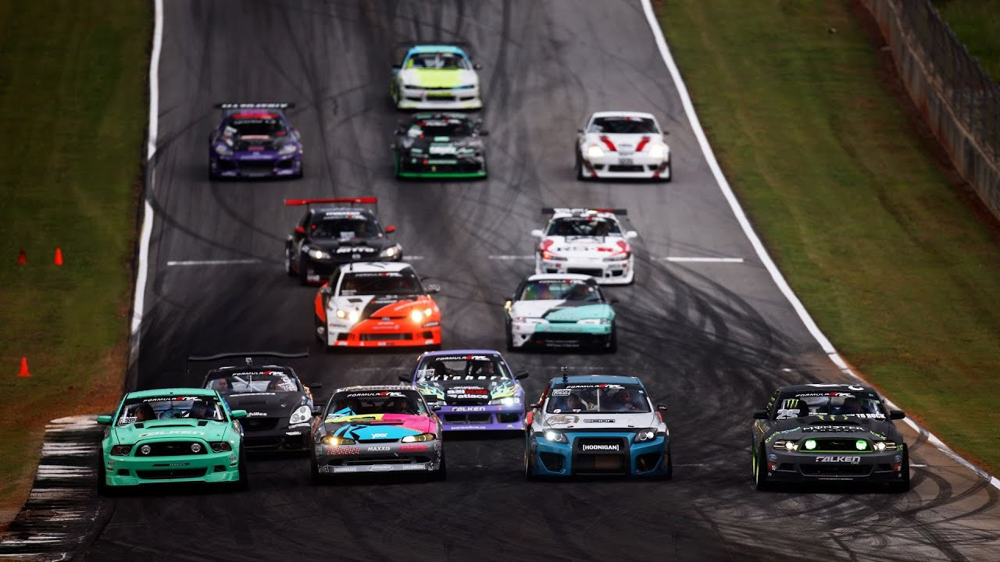
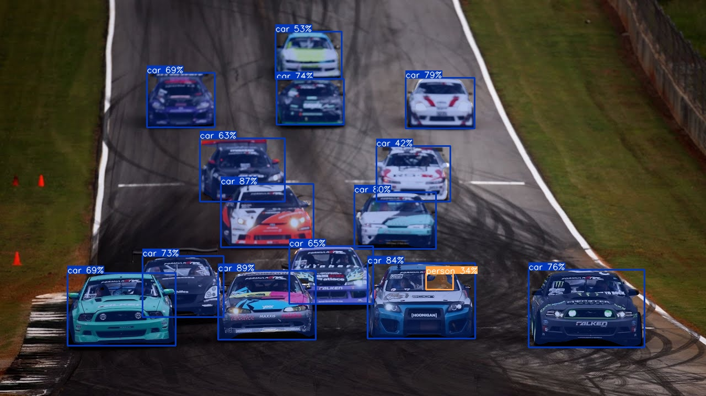
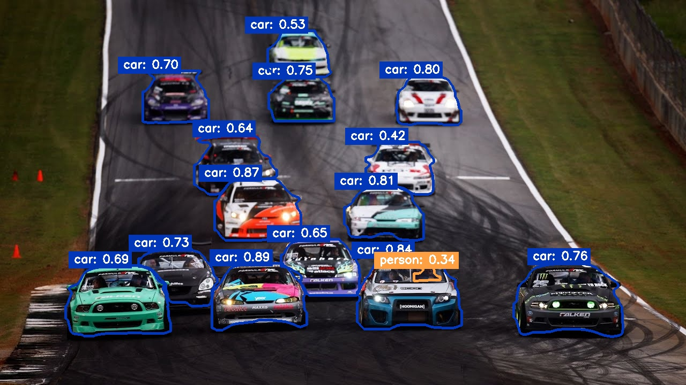

# Triton_yolov8-seg
This repository provides Python implementation of the YOLOv8 model for instance segmentation on images. Model uses `OpenCV` for image processing and `Triton Inference Server` for model inference.

## Installation
To get started, follow these steps:

1. Clone the repository:
```bash
git clone https://github.com/Shazy021/Triton_yolov8-seg.git
```

2. Start `Triton inference Server`:
```bash
docker run -p 8000:8000 --gpus=1 --rm -v ${PWD}/model_repository:/models nvcr.io/nvidia/tritonserver:24.07-py3 tritonserver --model-repository=/models
```
3. Install required packages:
```bash
pip install -r requirements.txt
```

## Usage example 
Run following command to perform segmentation on example image:
```bash
python3 client_example_seg.py --image ./data/example.jpg
```

## Original
<p align="center">
  
</p>

## Segmentation Results
<p align="center">
  
</p>

## Contour Visualization
<p align="center">
  
</p>

# Additional Notes
* Ensure you have Docker installed and configured to use GPU for optimal performance.
* Adjust the confidence threshold and IoU threshold in `client_example_seg.py` script as needed for your specific use case.
* For further customization, refer to the code in the repository.